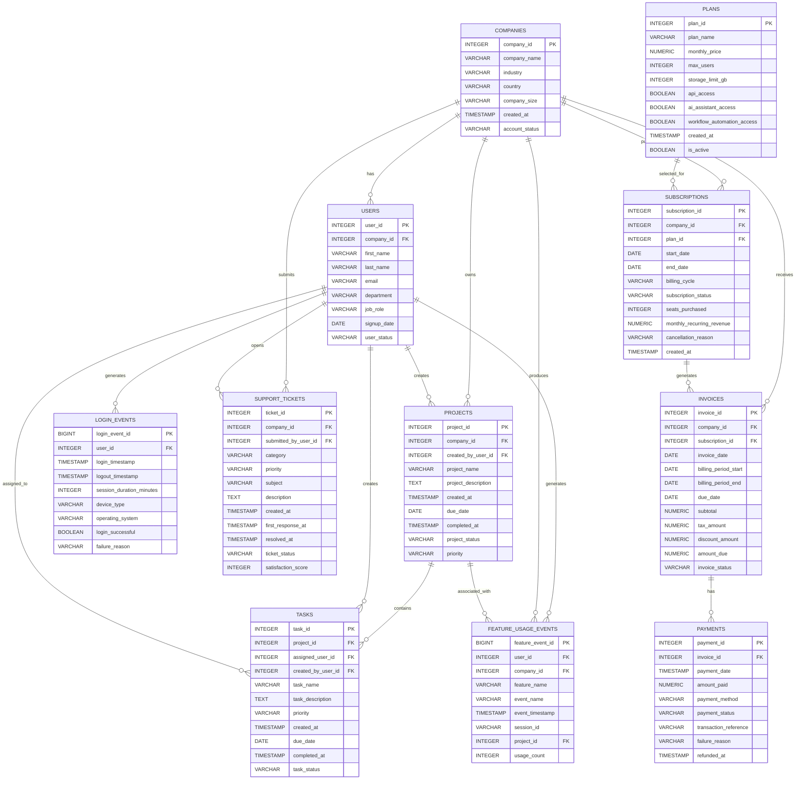

# Kraly Entity Relationship Diagram

```mermaid
erDiagram

    COMPANIES {
        INTEGER company_id PK
        VARCHAR company_name
        VARCHAR industry
        VARCHAR country
        VARCHAR company_size
        TIMESTAMP created_at
        VARCHAR account_status
    }

    USERS {
        INTEGER user_id PK
        INTEGER company_id FK
        VARCHAR first_name
        VARCHAR last_name
        VARCHAR email
        VARCHAR department
        VARCHAR job_role
        DATE signup_date
        VARCHAR user_status
    }

    PLANS {
        INTEGER plan_id PK
        VARCHAR plan_name
        NUMERIC monthly_price
        INTEGER max_users
        INTEGER storage_limit_gb
        BOOLEAN api_access
        BOOLEAN ai_assistant_access
        BOOLEAN workflow_automation_access
        TIMESTAMP created_at
        BOOLEAN is_active
    }

    SUBSCRIPTIONS {
        INTEGER subscription_id PK
        INTEGER company_id FK
        INTEGER plan_id FK
        DATE start_date
        DATE end_date
        VARCHAR billing_cycle
        VARCHAR subscription_status
        INTEGER seats_purchased
        NUMERIC monthly_recurring_revenue
        VARCHAR cancellation_reason
        TIMESTAMP created_at
    }

    PROJECTS {
        INTEGER project_id PK
        INTEGER company_id FK
        INTEGER created_by_user_id FK
        VARCHAR project_name
        TEXT project_description
        TIMESTAMP created_at
        DATE due_date
        TIMESTAMP completed_at
        VARCHAR project_status
        VARCHAR priority
    }

    TASKS {
        INTEGER task_id PK
        INTEGER project_id FK
        INTEGER assigned_user_id FK
        INTEGER created_by_user_id FK
        VARCHAR task_name
        TEXT task_description
        VARCHAR priority
        TIMESTAMP created_at
        DATE due_date
        TIMESTAMP completed_at
        VARCHAR task_status
    }

    LOGIN_EVENTS {
        BIGINT login_event_id PK
        INTEGER user_id FK
        TIMESTAMP login_timestamp
        TIMESTAMP logout_timestamp
        INTEGER session_duration_minutes
        VARCHAR device_type
        VARCHAR operating_system
        BOOLEAN login_successful
        VARCHAR failure_reason
    }

    FEATURE_USAGE_EVENTS {
        BIGINT feature_event_id PK
        INTEGER user_id FK
        INTEGER company_id FK
        VARCHAR feature_name
        VARCHAR event_name
        TIMESTAMP event_timestamp
        VARCHAR session_id
        INTEGER project_id FK
        INTEGER usage_count
    }

    SUPPORT_TICKETS {
        INTEGER ticket_id PK
        INTEGER company_id FK
        INTEGER submitted_by_user_id FK
        VARCHAR category
        VARCHAR priority
        VARCHAR subject
        TEXT description
        TIMESTAMP created_at
        TIMESTAMP first_response_at
        TIMESTAMP resolved_at
        VARCHAR ticket_status
        INTEGER satisfaction_score
    }

    INVOICES {
        INTEGER invoice_id PK
        INTEGER company_id FK
        INTEGER subscription_id FK
        DATE invoice_date
        DATE billing_period_start
        DATE billing_period_end
        DATE due_date
        NUMERIC subtotal
        NUMERIC tax_amount
        NUMERIC discount_amount
        NUMERIC amount_due
        VARCHAR invoice_status
    }

    PAYMENTS {
        INTEGER payment_id PK
        INTEGER invoice_id FK
        TIMESTAMP payment_date
        NUMERIC amount_paid
        VARCHAR payment_method
        VARCHAR payment_status
        VARCHAR transaction_reference
        VARCHAR failure_reason
        TIMESTAMP refunded_at
    }

    COMPANIES ||--o{ USERS : has
    COMPANIES ||--o{ SUBSCRIPTIONS : purchases
    PLANS ||--o{ SUBSCRIPTIONS : selected_for

    COMPANIES ||--o{ PROJECTS : owns
    USERS ||--o{ PROJECTS : creates

    PROJECTS ||--o{ TASKS : contains
    USERS ||--o{ TASKS : creates
    USERS ||--o{ TASKS : assigned_to

    USERS ||--o{ LOGIN_EVENTS : generates

    USERS ||--o{ FEATURE_USAGE_EVENTS : generates
    COMPANIES ||--o{ FEATURE_USAGE_EVENTS : produces
    PROJECTS ||--o{ FEATURE_USAGE_EVENTS : associated_with

    COMPANIES ||--o{ SUPPORT_TICKETS : submits
    USERS ||--o{ SUPPORT_TICKETS : opens

    COMPANIES ||--o{ INVOICES : receives
    SUBSCRIPTIONS ||--o{ INVOICES : generates

    INVOICES ||--o{ PAYMENTS : has
```